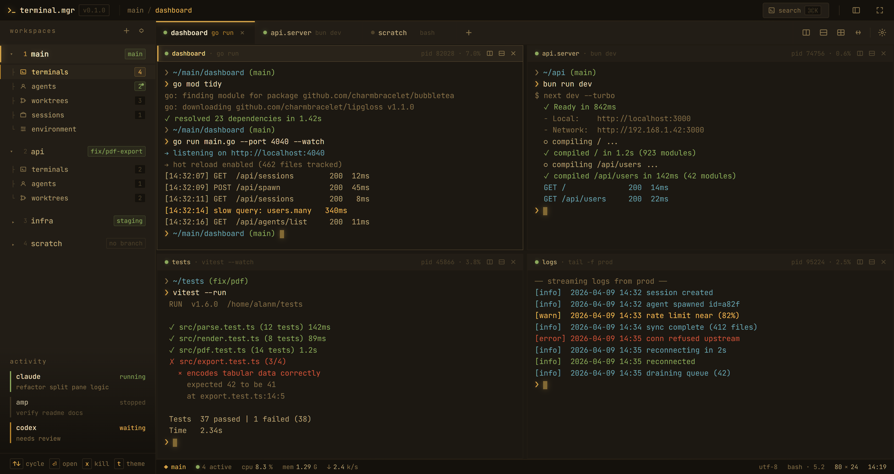
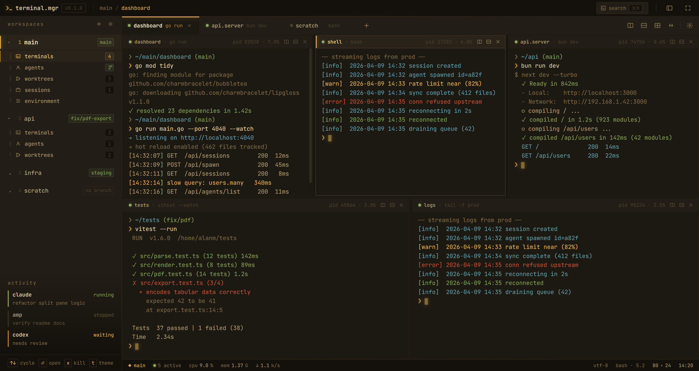

# Unshit Terminal Manager

A GPU-accelerated terminal manager for Windows with **tmux-style session persistence**. Your shells run in a background daemon, so long-running work keeps going after you close the window — reopen it and your tabs, splits, and panes reattach to the *same* live processes. All of it — tabbed, split-pane terminals and a keyboard-first command palette — is rendered on the GPU by a custom UI framework.



Unshit Terminal Manager is a native Windows terminal multiplexer built on **unshit**, a local GPU-first UI framework (CSS styling, flexbox/grid layout via [Taffy](https://github.com/DioxusLabs/taffy), a [wgpu](https://github.com/gfx-rs/wgpu) renderer, and [cosmic-text](https://github.com/pop-os/cosmic-text) for text shaping). Your shells run inside a background daemon that owns the PTYs, parsers, and scrollback — the same detach/reattach model as **tmux**, but backing a native GPU window instead of a text-mode multiplexer. The windows, tabs, and splits you left open survive a UI restart or crash, and commands you kicked off keep running while the UI is closed.

## Features

- **Tabbed, split-pane terminals** — open multiple tabs per workspace and split any pane horizontally or vertically into a resizable grid.
- **Workspaces** — group terminals by project, each with an optional working directory and a per-workspace shell override.
- **tmux-style persistent sessions** — tabs, splits, split ratios, and workspaces are saved to disk and restored on the next launch. Because the daemon owns the shells, a session survives closing the UI (or a UI crash) and reattaches to the *same* running process on reopen — a build or agent you kicked off keeps running in the background. Sessions only end on an explicit close or a daemon shutdown, never when the UI disconnects.
- **Command palette** (`Ctrl+Shift+P`) — a VS Code-style launcher with fuzzy search and typed modes: `>` for actions, `@` for agents, `:` for navigation, and `/` for scrollback. Drive splits, tabs, renames, the sidebar, and settings without leaving the keyboard.
- **Quick Prompt** (`Ctrl+Shift+Q`) — type a prompt, attach images, and launch an agent CLI (`claude` or `codex`) in a fresh git worktree. When the active workspace is a git repo it runs `git worktree add` so the agent works on an anonymous branch without disturbing your checkout; otherwise it falls back to a plain scratch directory.
- **Git awareness** — the sidebar detects the current branch for terminals whose working directory lives inside a repository.
- **Themes** — bundled palettes (Amber, Catppuccin, Tokyo Night, Nord, Dracula, Everforest, Rosé Pine, Gruvbox, and more) plus a customizable accent/surface/foreground theme.
- **Configurable keybindings** — every action has an editable default key combo, persisted as JSON and editable from Settings.
- **Scrollback navigation** — scroll back through terminal history and search it from the palette.
- **GPU rendering** — text and UI are drawn through wgpu, with cursor blink and resizes handled as renderer-side redraws rather than full rebuilds.



## Architecture

Unshit Terminal Manager ships as **two executables**:

| Process | Binary | Responsibility |
|---------|--------|----------------|
| UI | `terminal-manager.exe` | Windowing, GPU rendering, layout, input, the command palette, and Quick Prompt. |
| Daemon | `unshit-ptyd.exe` | Owns every PTY, terminal parser, and scrollback buffer. Sessions live here, keyed by `(workspace_id, pane_id)`. |

The UI and the daemon talk over a user-scoped **named pipe**. On startup the UI tries to connect to a running daemon; if none is reachable it spawns one (detached, with no console window) and retries with backoff.

**Why sessions persist:** the shells, their output, and their scrollback are owned by `unshit-ptyd`, not by the UI. When the UI is closed and relaunched, it reattaches to the daemon's existing sessions. The PTY write path is fire-and-forget, kept off the render path so input stays responsive.

**The sibling-executable requirement:** the UI locates the daemon as a sibling — the `unshit-ptyd` executable in the *same directory* as `terminal-manager.exe`. This matters when you distribute the app: **both binaries must sit in the same folder.** When you run from source, Cargo already places them together in `target/release/` (or `target/debug/`), so it just works. For development or CI you can override the lookup by pointing the `UNSHIT_PTYD_BINARY` environment variable at a specific daemon binary.

## Install

### For end users

Download the latest installer from the [Releases](https://github.com/alangmartini/unshit-agentic-terminal-manager/releases) page and run it. It installs per-user (no administrator prompt), adds a Start Menu shortcut, and registers an uninstaller in Add/Remove Programs. Both executables (`terminal-manager.exe` and `unshit-ptyd.exe`) are packaged together — keep them in the same folder if you move the install.

**Platform:** Windows (`x86_64-pc-windows-msvc`). The renderer uses wgpu, defaulting to Vulkan and falling back to Direct3D 12; you can force a backend with `UNSHIT_RENDER_BACKEND=vulkan|dx12`.

### For developers (build from source)

Prerequisites:

- A stable **Rust** toolchain (via [rustup](https://rustup.rs/)).
- The **MSVC** build tools (Visual Studio C++ Build Tools) — the default `x86_64-pc-windows-msvc` target.

Clone and build:

```powershell
git clone https://github.com/alangmartini/unshit-agentic-terminal-manager.git
cd unshit-agentic-terminal-manager
cargo build --release -p terminal-manager --bin terminal-manager
cargo build --release -p unshit-ptyd --bin unshit-ptyd
```

Both binaries land together in `target\release\`:

```text
target\release\terminal-manager.exe
target\release\unshit-ptyd.exe
```

Run it:

```powershell
cargo run --release
```

`cargo run` launches the UI, which finds and starts the sibling daemon for you. All assets — the CSS stylesheet, the JetBrains Mono fonts, and the bundled themes — are embedded into the binary, so there is nothing else to copy alongside the executables.

Repo builds automatically run in the **`dev` instance profile**: their own daemon
pipe, their own persisted sessions and config, and a `dev` badge in the titlebar.
You can keep the installed app open as your daily terminal while hacking on a
work-in-progress build — the two can never share a session. Tests and screenshot
scripts likewise run in throwaway profiles. See
[docs/DOGFOODING.md](docs/DOGFOODING.md) for the full model (`TM_PROFILE`,
`TM_CONFIG_DIR`, repo-scoped `scripts\kill-all.ps1`).

### Building the installer

The Windows installer is built with [Inno Setup 6](https://jrsoftware.org/isinfo.php). After a release build:

```powershell
cargo build --release -p terminal-manager --bin terminal-manager
cargo build --release -p unshit-ptyd --bin unshit-ptyd
& "$env:LOCALAPPDATA\Programs\Inno Setup 6\ISCC.exe" packaging\terminal-manager.iss
```

The result is `dist\terminal-manager-0.2.6-setup.exe`.

## Usage

- **Tabs:** `Ctrl+T` opens a new terminal; `Ctrl+Tab` / `Ctrl+Shift+Tab` cycle tabs; `Ctrl+Shift+W` closes a tab.
- **Splits:** `Ctrl+D` splits right, `Ctrl+Shift+D` splits down, `Ctrl+W` unsplits. Move focus between panes with `Ctrl+Alt+Arrow`; `Ctrl+Arrow` remains available to terminal applications for word navigation.
- **Command palette:** `Ctrl+Shift+P`. Type to fuzzy-search, or prefix your query with `>`, `@`, `:`, or `/` to scope the search. `Enter` runs the highlighted item, `Esc` clears the query then closes.
- **Quick Prompt:** `Ctrl+Shift+Q`. Type a prompt, optionally paste images, pick Claude or Codex, and submit to launch the agent in a fresh worktree.
- **Other:** `Ctrl+B` toggles the sidebar, `Ctrl+,` opens Settings, `F2` renames the active session, `Ctrl+=` / `Ctrl+-` zoom the font, `F11` toggles fullscreen.

## Configuration

User data is stored under your platform config and data directories:

| What | Location |
|------|----------|
| Workspaces, tabs, and pane layout | `%APPDATA%\com.godly.terminal\workspaces.json` |
| Quick Prompt agent worktrees | `%APPDATA%\com.godly.terminal\worktrees\` |

- **Keybindings** are editable in **Settings → Keybinds**. Each action keeps a stable id and is persisted as JSON; defaults follow Windows conventions (see the table above).
- **Themes** are chosen in Settings. Bundled palettes ship in `assets/themes.json`, and the *Custom* theme lets you set accent, surface, and foreground colors directly.
- **Shells** can be set app-wide or overridden per workspace from Settings.

## Development

Run the standard quality gates before sending a change:

```powershell
cargo fmt --check
cargo clippy -- -D warnings
cargo test
```

For UI- or layout-sensitive work, launch the app with `cargo run` and check it visually.

This repository also ships an `xtask` harness:

```powershell
# End-to-end desktop regression suite (drives the real app and asserts UI state)
cargo xtask desktop-regression
cargo xtask desktop-regression --list

# CPU / heap profiling helpers
cargo xtask profile cpu
cargo xtask profile memory
```

### Repository layout

```text
src/                          terminal-manager UI (state, PTY bridge, palette, quick prompt, themes, keybinds)
assets/                       embedded CSS, JetBrains Mono fonts, themes.json
packaging/                    Inno Setup script and the application icon
crates/unshit-ptyd/           the PTY session daemon (unshit-ptyd)
crates/unshit-framework/      the unshit UI framework (CSS, layout, wgpu renderer)
crates/unshit-terminal-core/  terminal emulation core
xtask/                        profiling and desktop-regression tooling
specs/, SPEC.md               feature specifications
```

The framework lives as a git subtree under `crates/unshit-framework/`. Prefer framework-level fixes for framework-level problems and keep app-specific behavior (PTY lifecycle, terminal wiring, product layout) in `src/`.

## License

[MIT](LICENSE).
