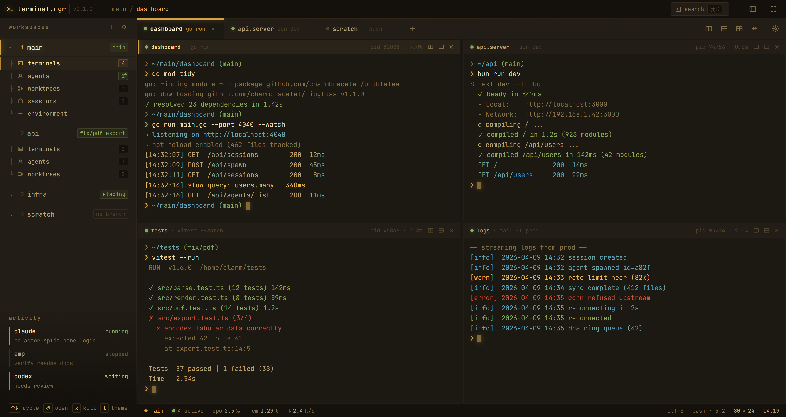
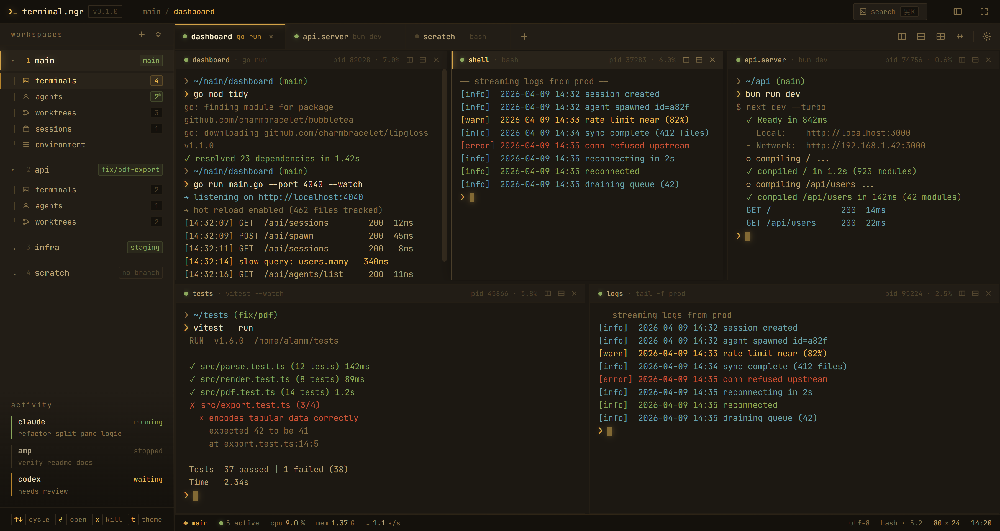

# Unshit Terminal Manager

A GPU-accelerated terminal manager for Windows with **tmux-style session persistence**. Your shells run in a background daemon, so long-running work keeps going after you close the window — reopen it and your tabs, splits, and panes reattach to the *same* live processes. All of it — tabbed, split-pane terminals and a keyboard-first command palette — is rendered on the GPU by a custom UI framework.



Unshit Terminal Manager is a native Windows terminal multiplexer built on **unshit**, a local GPU-first UI framework (CSS styling, flexbox/grid layout via [Taffy](https://github.com/DioxusLabs/taffy), a [wgpu](https://github.com/gfx-rs/wgpu) renderer, and [cosmic-text](https://github.com/pop-os/cosmic-text) for text shaping). Your shells run inside a background daemon that owns the PTYs, parsers, and scrollback — the same detach/reattach model as **tmux**, but backing a native GPU window instead of a text-mode multiplexer. The windows, tabs, and splits you left open survive a UI restart or crash, and commands you kicked off keep running while the UI is closed.

## Features

- **Tabbed, split-pane terminals** — open multiple tabs per workspace and split any pane horizontally or vertically into a resizable grid.
- **Workspaces** — group terminals by project, each with an optional working directory and a per-workspace shell override.
- **tmux-style persistent sessions** — tabs, splits, split ratios, and workspaces are saved to disk and restored on the next launch. Because the daemon owns the shells, a session survives closing the UI (or a UI crash) and reattaches to the *same* running process on reopen — a build or agent you kicked off keeps running in the background. Sessions only end on an explicit close or a daemon shutdown, never when the UI disconnects.
- **Command palette** (`Ctrl+Shift+P`) — a VS Code-style launcher with fuzzy search and typed modes: `>` for actions, `@` for agents, `:` for navigation, and `/` for scrollback. Drive splits, tabs, renames, the sidebar, and settings without leaving the keyboard.
- **Quick Prompt** (`Ctrl+Shift+Q`) — type a prompt, attach images, and launch an agent CLI (`claude` or `codex`) in a fresh git worktree. When the active workspace is a git repo it runs `git worktree add` so the agent works on an anonymous branch without disturbing your checkout; otherwise it falls back to a plain scratch directory.
- **Flow Explorer** — review a change as the *flows* it touches instead of a raw diff. **Explain flow…** / **Review change as flows…** in the palette ask your default agent (running in the workspace directory with the shipped `flow-explorer` skill) to write a small JSON model of one user-facing flow: the events, handlers, IPC hops and state it crosses, each with a one-sentence description, a source location and, in review mode, a diff status. The result opens as a native pane with three views: a collapsible call stack with inline source excerpts, Miller columns, and a swim-lane graph with numbered events you can zoom into. **Open flow…** opens a JSON an agent wrote elsewhere.
- **Agents subtab** — every workspace lists its panes under `terminals` and `agents`. A pane moves to `agents` when the app launched the agent, a SessionStart hook reported it, or automatic detection recognizes its running process or guest title (Claude Code, Codex, Gemini CLI, OpenCode, Aider, Copilot CLI, OpenRouter). Process detection runs in the Windows background monitor, including known Node/Bun/Python entrypoints, so manually started harnesses do not need to set a window title. Process-detected panes return to `terminals` when the agent exits. `Ctrl+Shift+A`, the palette, a **New agent ›** flyout on the workspace and subtab context menus, and `terminal-manager agent` from any shell all start a new agent tab in the workspace directory; **Kill all agents** on the subtab menu stops only the agent panes.
- **Agent conversation recovery** — if the PTY daemon is lost in a reboot or crash, a saved pane with an exact or unambiguous provider conversation id offers a provider-specific **Resume Claude/Codex** button the next time Terminal Manager is opened. Automatic recovery and **Start at Windows sign-in** are separate, default-off controls under **Settings → Sessions**; enable both for unattended recovery after a PC restart. A normal UI-only restart still reattaches to the already-running agent instead of launching a duplicate.
- **Git awareness** — the sidebar detects the current branch for terminals whose working directory lives inside a repository.
- **Themes** — bundled palettes (Amber, Catppuccin, Tokyo Night, Nord, Dracula, Everforest, Rosé Pine, Gruvbox, and more) plus a customizable accent/surface/foreground theme.
- **Configurable keybindings** — every action has an editable default key combo, persisted as JSON and editable from Settings.
- **Scrollback navigation** — scroll back through terminal history and search it from the palette.
- **GPU rendering** — text and UI are drawn through wgpu, with cursor blink and resizes handled as renderer-side redraws rather than full rebuilds.



## Architecture

Unshit Terminal Manager ships as **two executables**:

| Process | Binary | Responsibility |
|---------|--------|----------------|
| UI | `terminal-manager.exe` | Windowing, GPU rendering, layout, input, the command palette, and Quick Prompt. |
| Daemon | `unshit-ptyd.exe` | Owns every PTY, terminal parser, and scrollback buffer. Sessions live here, keyed by `(workspace_id, pane_id)`. |

The UI and the daemon talk over a user-scoped **named pipe**. On startup the UI tries to connect to a running daemon; if none is reachable it spawns one (detached, with no console window) and retries with backoff.

**Why sessions persist:** the shells, their output, and their scrollback are owned by `unshit-ptyd`, not by the UI. When the UI is closed and relaunched, it reattaches to the daemon's existing sessions. The PTY write path is fire-and-forget, kept off the render path so input stays responsive.

**The sibling-executable requirement:** the UI locates the daemon as a sibling — the `unshit-ptyd` executable in the *same directory* as `terminal-manager.exe`. This matters when you distribute the app: **both binaries must sit in the same folder.** When you run from source, Cargo already places them together in `target/release/` (or `target/debug/`), so it just works. For development or CI you can override the lookup by pointing the `UNSHIT_PTYD_BINARY` environment variable at a specific daemon binary.

## Install

### For end users

Download the latest installer from the [Releases](https://github.com/alangmartini/unshit-agentic-terminal-manager/releases) page and run it. It installs per-user (no administrator prompt), adds a Start Menu shortcut, and registers an uninstaller in Add/Remove Programs. Both executables (`terminal-manager.exe` and `unshit-ptyd.exe`) are packaged together — keep them in the same folder if you move the install.

**Platform:** Windows (`x86_64-pc-windows-msvc`). The renderer uses wgpu, defaulting to Vulkan and falling back to Direct3D 12; you can force a backend with `UNSHIT_RENDER_BACKEND=vulkan|dx12`.

### For developers (build from source)

Prerequisites:

- A stable **Rust** toolchain (via [rustup](https://rustup.rs/)).
- The **MSVC** build tools (Visual Studio C++ Build Tools) — the default `x86_64-pc-windows-msvc` target.

Clone and build:

```powershell
git clone https://github.com/alangmartini/unshit-agentic-terminal-manager.git
cd unshit-agentic-terminal-manager
cargo build --release -p terminal-manager --bin terminal-manager
cargo build --release -p unshit-ptyd --bin unshit-ptyd
```

Both binaries land together in `target\release\`:

```text
target\release\terminal-manager.exe
target\release\unshit-ptyd.exe
```

Run it:

```powershell
cargo run --release
```

`cargo run` launches the UI, which finds and starts the sibling daemon for you. All assets — the CSS stylesheet, the JetBrains Mono fonts, and the bundled themes — are embedded into the binary, so there is nothing else to copy alongside the executables.

Repo builds automatically run in the **`dev` instance profile**: their own daemon
pipe, their own persisted sessions and config, and a `dev` badge in the titlebar.
You can keep the installed app open as your daily terminal while hacking on a
work-in-progress build — the two can never share a session. Tests and screenshot
scripts likewise run in throwaway profiles. See
[docs/DOGFOODING.md](docs/DOGFOODING.md) for the full model (`TM_PROFILE`,
`TM_CONFIG_DIR`, repo-scoped `scripts\kill-all.ps1`).

### Building the installer

The Windows installer is built with [Inno Setup 6](https://jrsoftware.org/isinfo.php). After a release build:

```powershell
cargo build --release -p terminal-manager --bin terminal-manager
cargo build --release -p unshit-ptyd --bin unshit-ptyd
& "$env:LOCALAPPDATA\Programs\Inno Setup 6\ISCC.exe" packaging\terminal-manager.iss
```

The result is `dist\terminal-manager-0.5.0-setup.exe`.

## Usage

- **Git diff review:** click **Review diff** in the titlebar, or find **Review Git diff** in the command palette. Choose **Last N commits** (first-parent history), **Unpushed** (the locally known push target), or **Compare base** (a branch, tag, or SHA; changes since its common ancestor with HEAD). Select a file to inspect the numbered unified patch. Enter a count/base and press Enter or **Refresh** to reload; Escape closes the view. Uses the focused session's recorded launch directory when available, otherwise the workspace directory. Staged and working-tree edits are excluded. It does not fetch or modify the repository. Large patches paginate; individual Git queries have a 4 MiB preview limit and 15-second timeout.

- **Tabs:** `Ctrl+T` opens a new terminal; `Ctrl+Tab` / `Ctrl+Shift+Tab` cycle tabs; `Ctrl+Shift+W` closes a tab.
- **Splits:** `Ctrl+D` splits right, `Ctrl+Shift+D` splits down, `Ctrl+W` unsplits. Move focus between panes with `Ctrl+Alt+Arrow`; `Ctrl+Arrow` remains available to terminal applications for word navigation.
- **Command palette:** `Ctrl+Shift+P`. Type to fuzzy-search, or prefix your query with `>`, `@`, `:`, or `/` to scope the search. `Enter` runs the highlighted item, `Esc` clears the query then closes.
- **Quick Prompt:** `Ctrl+Shift+Q`. Type a prompt, optionally paste images, pick Claude or Codex, and submit to launch the agent in a fresh worktree.
- **Flow Explorer:** open the palette and pick **Explain flow…** (name the flow, e.g. *Send a prompt*) or **Review change as flows…** (a `base..head`, blank for the default branch up to `HEAD`). An agent tab opens; approve its single write if your agent asks, and the flow appears as a new tab when it finishes. Inside the pane: `Ctrl+1/2/3` switch call stack / panes / graph, arrows and `Enter` walk the tree or columns, `s` opens the source excerpt, `e`/`c` expand or collapse everything. The skill the app sends lives at `assets/flow-explorer/SKILL.md` and can be copied into `~/.claude/skills/` to run it by hand; **Open flow…** opens the resulting JSON.
- **Agents:** `Ctrl+Shift+A` starts the first installed agent CLI (checked in the order Claude Code, Codex, Gemini CLI, OpenCode, Aider, Copilot CLI; Claude Code when none is found) in the active workspace; right-click a workspace or its `agents` subtab for **New agent ›** with one row per installed CLI, or run `terminal-manager agent codex` from a terminal to open one in that terminal's workspace (`--workspace-id N` targets another). Manually started agents are detected by process on the next successful background scan (normally within one second), with guest titles as a fallback. OpenRouter-backed tools are recognized by their harness (for example, OpenCode or Aider); an OpenRouter title or executable also identifies the OpenRouter profile. Unknown wrappers may still need an identifying title. Right-click the `agents` subtab and choose **Kill all agents** to stop them; plain terminals are left alone.
- **Agent recovery:** after a cold restart, open Terminal Manager and use the **Resume Claude/Codex** chip in an affected pane with an exact or unambiguous conversation id. For unattended recovery after Windows restarts, enable both **Start at Windows sign-in** and **Automatic agent resume** in **Settings → Sessions**. Enabling automatic resume immediately installs the minimal SessionStart capture hooks used to remember exact ids. Turning it off leaves those hooks installed for manual recovery; use **Remove recovery hooks** in the same section to remove only Terminal Manager's managed entries.
- **Other:** `Ctrl+B` toggles the sidebar, `Ctrl+,` opens Settings, `F2` renames the active session, `Ctrl+=` / `Ctrl+-` zoom the font, `F11` toggles fullscreen.

Git review offers **Unified** and **Side by side** views. Split view pairs the old and new lines, shares vertical scrolling, and wraps long lines within each column. Narrow windows can scroll horizontally to see both columns. Switching views keeps the loaded file and range and preserves a selected hunk; otherwise it returns to the beginning. It does not query Git again.

Use **Previous hunk** / **Next hunk** to jump between changed sections of the open file. The target header appears at the top and the counter shows your position. **File start** returns to the beginning. Navigation crosses row-page boundaries without reloading Git; the footer shows the visible row range. Binary and metadata-only patches have no text hunks.

Click **Mark viewed** after reviewing a file; **Viewed · Undo** clears the mark. The sidebar labels viewed files, and the progress count includes all files in the range, regardless of the path filter. Marks survive file navigation and layout changes without hiding the patch. Refreshing/changing the range or closing the review clears them. Marks are kept only for the current review session.

Use **Filter files** to narrow the changed-file list by path, including a renamed file's former path. Matching ignores case and accepts either slash style. Filtering leaves the open patch in place and shows a notice if it is outside the results. **Clear filter** restores the complete list; no Git query is needed.

## Configuration

User data is stored under your platform config and data directories:

| What | Location |
|------|----------|
| Workspaces, tabs, and pane layout | `%APPDATA%\com.godly.terminal\workspaces.json` |
| Custom agent detection rules | `%APPDATA%\com.godly.terminal\agent-detection.json` |
| Quick Prompt agent worktrees | `%APPDATA%\com.godly.terminal\worktrees\` |
| Redacted agent recovery events | `%APPDATA%\com.godly.terminal\agent-restore-events.jsonl` |
| Renderer performance/recovery events | `%APPDATA%\com.godly.terminal\renderer-events.jsonl` |
| Agent tab classification, launch and kill events | `%APPDATA%\com.godly.terminal\agent-events.jsonl` |
| Terminal mode changes (alternate screen, mouse reporting) and selection auto-scroll events | `%APPDATA%\com.godly.terminal\terminal-events.jsonl` |
| Editor pane opens, saves, pastes, find and quick open events | `%APPDATA%\com.godly.terminal\editor-events.jsonl` |
| Diff pane requests, navigation and file opens | `%APPDATA%\com.godly.terminal\diff-events.jsonl` |
| Flow Explorer opens, producer launches and hand-offs | `%APPDATA%\com.godly.terminal\flow-events.jsonl` |
| Per-pane CPU and memory sampling events | `%APPDATA%\com.godly.terminal\resource-events.jsonl` |
| Startup phase timings | `%APPDATA%\com.godly.terminal\startup-events.jsonl` |
| Opt-in Windows login startup | `HKCU\Software\Microsoft\Windows\CurrentVersion\Run` (`Unshit Terminal Manager` value) |

- **Keybindings** are editable in **Settings → Keybinds**. Each action keeps a stable id and is persisted as JSON; defaults follow Windows conventions (see the table above).
- **Themes** are chosen in Settings. Bundled palettes ship in `assets/themes.json`, and the *Custom* theme lets you set accent, surface, and foreground colors directly.
- **Shells** can be set app-wide or overridden per workspace from Settings.
- **Agent recovery** stores only minimal routing and launch metadata in the workspace file: provider, stable workspace and pane identity, cwd, launch mode and phase, managed-pane flag, opaque session id, and observation time. Workspace numeric ids are stable and are not renumbered when another workspace is removed. Prompt text, transcript content, terminal output, and hook payloads are never stored in this record or in recovery telemetry.
- **Recovery discovery** reads at most the first 128 KiB and 64 JSONL records from each recent provider metadata candidate, extracts only the allowlisted session id and cwd, and does not retain or log the remaining content. Ambiguous matches fail closed and do not offer or automatically launch a conversation.
- **Recovery hooks** are merged into Claude Code and Codex user hook settings without replacing unrelated hooks. Disabling automatic launch keeps them installed so manual recovery can continue capturing ids; **Remove recovery hooks** removes only entries marked as managed by Terminal Manager.
- **Windows login startup** stores a quoted absolute executable path directly in the current user's `Run` key. It does not use a command shell, request administrator access, or enable agent recovery consent. The installer removes only Terminal Manager's owned value during uninstall.
- **Recovery IPC and files** are owner-scoped: clients verify the connected server's Windows SID or Unix uid before sending hook metadata, Unix servers reject other-owner peers, hook edits refuse symlinks/reparse points, and recovery state/telemetry use owner-private files. If the final close-state save fails, Terminal Manager stays open and offers a retry instead of allowing stale agent metadata to return on the next launch.

### Custom agent detection

Create `agent-detection.json` beside `workspaces.json` to recognize a harness that the built-in detector does not know. Copy [the example configuration](assets/agent-detection.example.json) and replace its names and paths:

```json
{
  "rules": [
    { "profile": "my-agent", "executable": "my-agent.exe" },
    {
      "profile": "openrouter",
      "executable": "node.exe",
      "args_prefix": ["C:/tools/router/cli.js"]
    },
    {
      "profile": "my-python-agent",
      "executable": "python.exe",
      "args_prefix": ["-m", "my_agent"]
    }
  ]
}
```

The Windows background monitor reloads this file once per second. Changes apply to running panes; deleting the file or setting `rules` to `[]` removes custom detection. Invalid edits keep the last valid rules active and log a warning. Repo builds use `%APPDATA%\com.godly.terminal.dev`; named profiles use `com.godly.terminal.<profile>`. `TM_CONFIG_DIR` overrides the directory.

- `profile` is an existing profile ID (`claude`, `codex`, `gemini`, `opencode`, `aider`, `copilot`, `openrouter`) or a custom name displayed in Agents. Use 1–64 lowercase ASCII letters, digits, hyphens or underscores, starting with a letter or digit.
- `executable` matches the running process's basename, ignoring case and an optional `.exe` suffix. Use the actual process image, not a `.cmd`/`.ps1` launcher. Paths and wildcards are not accepted.
- `args_prefix` matches consecutive, complete arguments immediately after the executable. Shells and runtimes require it; include enough arguments to identify the harness, not just generic runtime flags. Quoted spaces are supported. Arguments containing `/` or `\` ignore slash style and ASCII case; all other arguments are case-sensitive. No substring search, environment expansion or command execution occurs.
- For each process, built-in detection wins over custom rules; otherwise, the first matching rule wins. The outermost detected harness wins when agents launch other agents. Rules classify panes only; they do not add launch commands or conversation recovery. Process tags clear when a successful scan no longer finds a match; explicit launches and hooks retain priority.
- Files are limited to 64 KiB and 64 rules. Each executable is at most 128 bytes; each prefix has at most 16 arguments of at most 1024 bytes each. Unknown JSON fields are rejected so typos do not silently broaden a rule.

## Development

Run the standard quality gates before sending a change:

```powershell
cargo fmt --check
cargo clippy -- -D warnings
cargo test
```

For UI- or layout-sensitive work, launch the app with `cargo run` and check it visually.

This repository also ships an `xtask` harness:

```powershell
# End-to-end desktop regression suite (drives the real app and asserts UI state)
cargo xtask desktop-regression
cargo xtask desktop-regression --list

# CPU / heap profiling helpers
cargo xtask profile cpu
cargo xtask profile memory
```

### Repository layout

```text
src/                          terminal-manager UI (state, PTY bridge, palette, quick prompt, themes, keybinds)
assets/                       embedded CSS, JetBrains Mono fonts, themes.json, the flow-explorer skill
packaging/                    Inno Setup script and the application icon
crates/unshit-ptyd/           the PTY session daemon (unshit-ptyd)
crates/unshit-framework/      the unshit UI framework (CSS, layout, wgpu renderer)
crates/unshit-terminal-core/  terminal emulation core
xtask/                        profiling and desktop-regression tooling
specs/, SPEC.md               feature specifications
```

The framework lives as a git subtree under `crates/unshit-framework/`. Prefer framework-level fixes for framework-level problems and keep app-specific behavior (PTY lifecycle, terminal wiring, product layout) in `src/`.

## License

[MIT](LICENSE).
